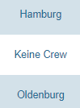
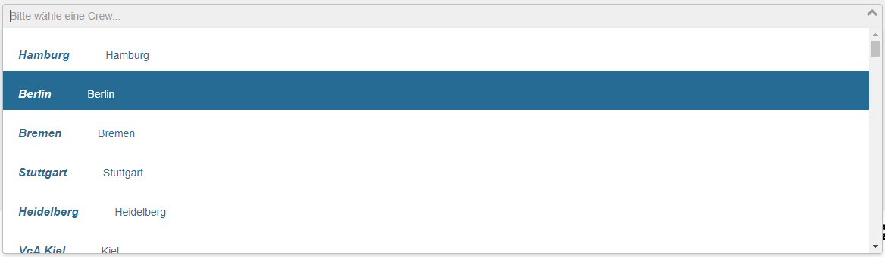
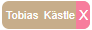
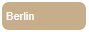
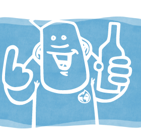
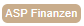
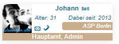
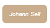
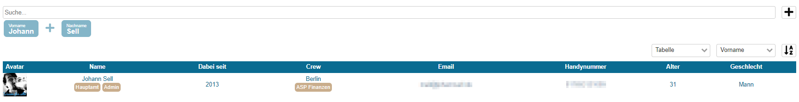

# WidgetUser

[](https://www.npmjs.com/package/vca-widget-user) [](https://vuejs.org/)

> Implements different visualizations for a user.

## Preconditions
Using this package requires a running version of [Drops](https://github.com/Viva-con-Agua/drops), that has already 
implemented [issue #225](https://github.com/Viva-con-Agua/drops/issues/225). Additionally, the web server you are using
to run the front end application using this widget, has to use the same domain and the same port as 
[Drops](https://github.com/Viva-con-Agua/drops). [Drops](https://github.com/Viva-con-Agua/drops) has to be deployed 
using the path prefix `/drops/`.

## Widgets
This package implements several UI elements to handle user-specific interaction with the business objects `User` and 
`Crew` of the Pool² (e.g. input fields to search for a user or HTML and CSS code to present a user in a standard way). 
Using the widgets implemented here, you can ensure that users of your microservice will have the same user experience 
regarding other users as using the other microservices of Pool².

### Plain crew name
Since microservices should be loosely coupled, ideally they only save references to data objects managed by other 
microservices. Therefore, you need widgets to print a data object, if you only have a reference. 

This widget prints a crew name by a given crews `UUID`.



You can use it that way:
```xml
<CrewPlainName id="606693fe-c057-4f05-8b29-2cc4975dda82" />
```
Since it has been implemented as a simple `<span>` tag without any styling, you can define the font and background color
as you want.

| Parameter | Type | Optional | Default | Description |
|-----------|------|----------|---------|-------------|
| `id` | String | required | *No default value* | The crews `UUID`. It will be used for an ajax request to obtain the crew object. |

*There are no slots for this widget*

*There are no events of this widget*

### Crew select
It allows the user to select a crew. The widget fires an event after selection that returns the `UUID` of the selected 
crew.



You can use it that way (`crewUuid` and `handler` are example names for variable and function):
```xml
<CrewSelect value="crewUuid" :disabled="false" v-on:input="handler" />
```

| Parameter | Type | Optional | Default | Description |
|-----------|------|----------|---------|-------------|
| `value` | String | optional | `""` | The `UUID` of the crew selected by default (e.g. a previously selected value). |
| `disabled` | Boolean | optional | `false` | Indicates if the select box is disabled. |

*There are no slots for this widget* 

| Event | Data |
|-------|------|
| `input` | The `UUID` of the selected crew. |

### Tag
Using this widget, you can show user or crew names as small (removable) tags. On click, the user will be redirected to 
the profile page of the user that is represented by the tag. 

 


You can use it that way:
```xml
<Tag uuid="606693fe-c057-4f05-8b29-2cc4975dda82" :removable="false" :crew="false" />
```

| Parameter | Type | Optional | Default | Description |
|-----------|------|----------|---------|-------------|
| `uuid` | String | optional | *No default value* | The `UUID` of the user whose name has to be printed. |
| `user` | Object | optional | *No default value* | The whole user object, thus an additional ajax request (in contrast to the parameter `uuid`) is not required. |
| `removable` | Boolean | optional | `false` | Indicates if the "X" button has to be visible. |
| `crew` | Boolean | optional | `false` | If set to `true` the name of the users crew instead of the individuals name is been used.  |

*There are no slots for this widget*

| Event | Data |
|-------|------|
| `vca-user-remove` | The `object` representing the removed user. |
| `vca-user-focus` | The `object` representing the focused user. |
| `vca-user-blur` | The `object` representing the blurred user. | 

### Avatar
Shows the avatar (profile image) of a user.




You can use it that way:
```xml
<Avatar :user="user" type="type" />
```

| Parameter | Type | Optional | Default | Description |
|-----------|------|----------|---------|-------------|
| `user` | Object | optional | *No default value* | The whole user object. |
| `type` | String | required | - | The `type` can be `'medium'` (4em x 4em), `'large'` (10em x 10em) or `'profile'` (20em x 20em). |

*There are no slots for this widget*

*There are no events of this widget*

### VcA Role
Shows the role of a user as a tag.



You can use it that way:
```xml
<VcARole name="VolunteerManager" pillar="network" />
```

| Parameter | Type | Optional | Default | Description |
|-----------|------|----------|---------|-------------|
| `name` | String | optional | *No default value* | The name of the role that will be shown. Possible values: `admin`, `employee`, `supporter`, `VolunteerManager` |
| `pillar` | String | optional | *No default value* | If the role to be shown is a volunteer manager, the area of responsibility can be described here. Possible values: `network`, `operation`, `finance`, `education` |
| `translated` | String | optional | *No default value* | If you already have a translated string, you can force the `VcARole` to use it by passing it through this attribute. |

*There are no slots for this widget*

*There are no events of this widget*

### User Widget

Visualizes a user in various forms.





You can use it that way:
```xml
<UserWidget uuid="13e42965-cd78-459a-97e0-35a91c01ab4d" type="large" />
```

| Parameter | Type | Optional | Default | Description |
|-----------|------|----------|---------|-------------|
| `uuid` | UUID | optional | *No default value* | If given, the printed user will be requested from Drops when the widget is created by an ajax request. |
| `user` | Object | optional | *No default value* | If given, the object will be interpreted as complete user that will be printed. No additional ajax requests are required. |
| `type` | String | required | - | Indicates the form of presentation. There are three different forms (and thus are the values of the attribute): `small`, `medium` and `large` |
| `removable` | Boolean | optional | `false` | If the `type` is set to `small` and `removable` is `true`, a small button labeled with "X" will be shown at the right border of the widget. A click triggers a `vca-user-remove` event. |

*There are no slots for this widget*

| Event | Data |
|-------|------|
| `vca-user-remove` | The `object` representing the removed user. |
| `vca-user-focus` | The `object` representing the focused user. |
| `vca-user-blur` | The `object` representing the blurred user. | 

### User Widget List
Shows a set of users and implements functions to search through, sort and paginate the set. There are four different forms
of visualizing the set: as large [user widget](user-widget), as medium [user widget](user-widget), as small [user widget](user-widget) and as table columns. 



You can use it that way:
```xml
<WidgetUserList :options="{ lang: 'de-DE', type: { menue: true, value: 'table' }, sorting: { menue: { field: 'Supporter_firstName', dir: 'ASC' } }, pagination: { activated: true, size: 40, sliding: 20 } }" />
```

| Parameter | Type | Optional | Default | Description |
|-----------|------|----------|---------|-------------|
| `options` | Object | optional | *See example* | Configures the widget. Consider: `type: menue` indicates if sort and search function have to be visible, `type: value` configures the visualization of users (allowed values: `table`, `big widgets` (large [user widget](user-widget)), `small widgets` (medium [user widget](user-widget)), `tags` (small [user widget](user-widget))), `sorting: menue: field` allows all attributes of a user, `pagination: size` defines the number of users shown on a page and `pagination: sliding` defines the number of users that are removed at the beginning of a page and appended at the end of page on a page switch. |

*There are no slots for this widget*

*There are no events of this widget*

### User Widget Autocomplete

You can use it that way:
```xml
<WidgetUserAutocomplete placeholder="Enter user name..." />
```

| Parameter | Type | Optional | Default | Description |
|-----------|------|----------|---------|-------------|
| `placeholder` | String | optional | *No default value* | The placeholder for the input field. |
| `preselection` | Array of user objects | optional | `[]` | Used to pass all already selected users. They will be shown as removable tags. |

*There are no slots for this widget*

| Event | Data |
|-------|------|
| `vca-user-selection` | An `Array` of selected user objects. |

## Installation

```bash
npm install --save vca-widget-user
```

## Usage

### Bundler (Webpack, Rollup)

```js
import Vue from 'vue'
import WidgetUserList from 'vca-widget-user'
// You need a specific loader for CSS files like https://github.com/webpack/css-loader
import 'vca-widget-user/dist/vca-widget-user.css'

Vue.use(WidgetUserList)

export default {
  name: 'App',
  components: { WidgetUserList },
  data () {
    return { options: {
      'type': { 'menue': true, 'value': 'table' },
      'sorting': { 'menue': { 'field': 'Supporter_firstName', 'dir': 'ASC' } },
      'lang': 'de'
    } }
  }
}

```

Inside your template:
```xml
<template>
  <div id="app">
    <WidgetUserList :options="options" />
  </div>
</template>
```

#### Existing internationalization
If you already use [vue-i18n](https://www.npmjs.com/package/vue-i18n) to handle your internationalization and localization, we have to merge our messages into 
yours. You can do this in your `main.js` before you instantiate your Vue App.

```js
import Vue from 'vue';
...
import VueI18n from 'vue-i18n';
import WidgetUserList from 'vca-widget-user' // use `WidgetUser` if you don't need a list of users

Vue.use(VueI18n);

const i18n = new VueI18n({
    locale: locale,
    messages: {
        'en-US': require('@/lang/en_US'),
        'de-DE': require('@/lang/de_VCA'),
        'ja-JA': require('../node_modules/element-ui/lib/locale/lang/ja')
    }
});

// the most important line of code here
Vue.use(WidgetUserList, { 'i18n': i18n })

/* eslint-disable no-new */

new Vue({
  ...
  i18n,
  components: { WidgetUserList },
  ...
}).$mount('#app');
```
Afterwards, you don't have to use `Vue.use(WidgetUserList)` in your components again.

### Browser

```html
<!-- Include after Vue -->
<!-- Local files -->
<link rel="stylesheet" href="widget-user/dist/widget-user.css"></link>
<script src="vca-widget-user/dist/widget-user.js"></script>

<!-- From CDN -->
<link rel="stylesheet" href="https://unpkg.com/vca-widget-user/dist/widget-user.css"></link>
<script src="https://unpkg.com/vca-widget-user"></script>
```

## Development

### Launch visual tests

```bash
npm run dev
```

### Launch Karma with coverage

```bash
npm run dev:coverage
```

### Build

Bundle the js and css of to the `dist` folder:

```bash
npm run build
```


## Publishing

The `prepublish` hook will ensure dist files are created before publishing. This
way you don't need to commit them in your repository.

```bash
# Bump the version first
# It'll also commit it and create a tag
npm version
# Push the bumped package and tags
git push --follow-tags
# Ship it 🚀
npm publish
```

## License

[MIT](http://opensource.org/licenses/MIT)
